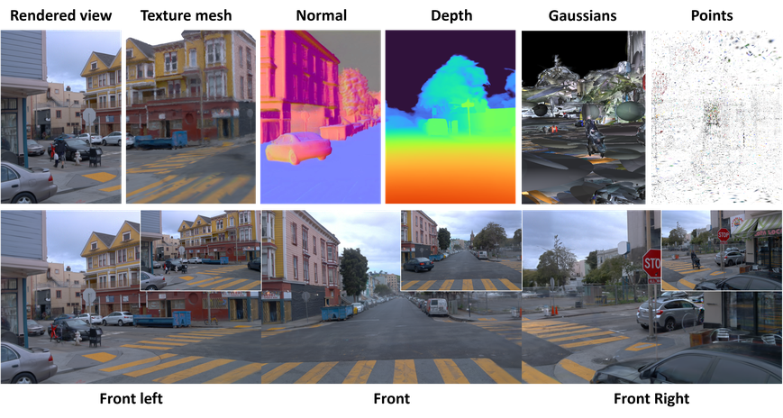
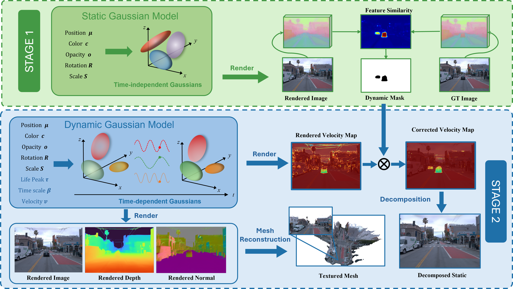
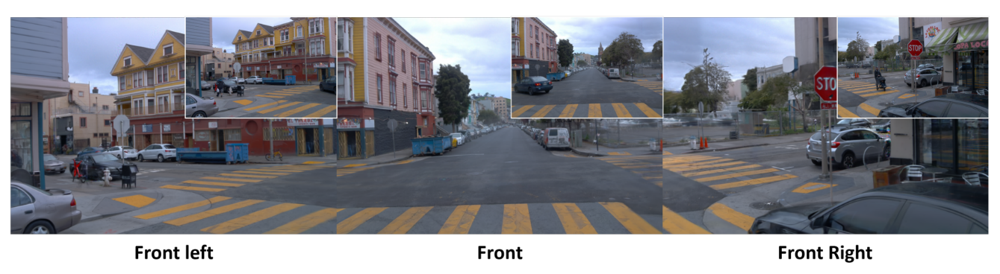
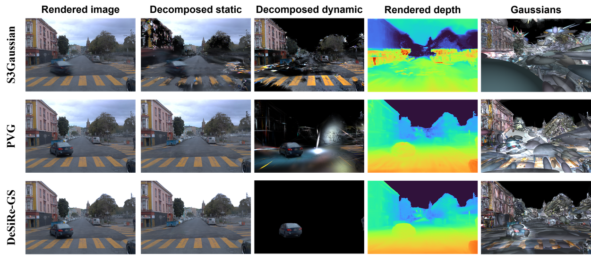

<h1 align="center"> DeSiRe-GS  </h1> 

<div class="alert alert-info">
<p align="center">
  
</p>
</div>


> [**DeSiRe-GS: 4D Street Gaussians for Static-Dynamic Decomposition and Surface Reconstruction for Urban Driving Scenes**](https://arxiv.org/abs/2311) 
>
> [Chensheng Peng](https://pholypeng.github.io/), [Chengwei Zhang](https://chengweialan.github.io/), [Yixiao Wang](https://yixiaowang7.github.io/), [Chenfeng Xu](https://www.chenfengx.com/), [Yichen Xie](https://scholar.google.com/citations?user=SdX6DaEAAAAJ), [Wenzhao Zheng](https://wzzheng.net/), [Kurt Keutzer](https://people.eecs.berkeley.edu/~keutzer/), [Masayoshi Tomizuka](https://me.berkeley.edu/people/masayoshi-tomizuka/), [Wei Zhan](https://zhanwei.site/)
> 
> **Arxiv preprint**


## 📖 Overview

<div class="alert alert-info">
<p align="center">
  
</p>
</div>


## 🛠️ Installation

We test our code on Ubuntu 20.04 using Python 3.10 and PyTorch 2.2.0. We recommend using conda to install all the independencies. 


1. Create the conda environment and install requirements. 

```
# Clone the repo.
git clone https://github.com/PholyPeng/DeSiRe-GS.git
cd DeSiRe-GS

# Create the conda environment.
conda create -n DeSiReGS python==3.10
conda activate DeSiReGS

# Install torch. 
pip install torch==2.2.0 torchvision==0.17.0 --index-url https://download.pytorch.org/whl/cu118 # replace with your own CUDA version

# Install requirements.
pip install -r requirements.txt
```

2. Install the submodules. The repository contains the same submodules as [PVG](https://github.com/fudan-zvg/PVG).

```
# Install simple-knn
git clone https://gitlab.inria.fr/bkerbl/simple-knn.git
pip install ./simple-knn

# a modified gaussian splatting (for feature rendering)
git clone --recursive https://github.com/SuLvXiangXin/diff-gaussian-rasterization
pip install ./diff-gaussian-rasterization

# Install nvdiffrast (for Envlight)
git clone https://github.com/NVlabs/nvdiffrast
pip install ./nvdiffrast
```


## 💾 Data Preparation

Create a directory to save the data. Run ```mkdir dataset```.

### Waymo Dataset

We provide following subsets from Waymo Open Dataset. Click [here] for data preprocessing details.

|                     Source                     | Number of Sequences |       Scene Type        | Description                                                  |
| :--------------------------------------------: | :-----------------: | :---------------------: | ------------------------------------------------------------ |
|    [PVG](https://github.com/fudan-zvg/PVG)     |          4          |         Dynamic         | • Refer to [this page](https://github.com/fudan-zvg/PVG?tab=readme-ov-file#data-preparation). |
|    [OmniRe](https://ziyc.github.io/omnire/)    |          8          |         Dynamic         | • Described as highly complex dynamic<br>• Refer to [this page](https://github.com/ziyc/drivestudio/blob/main/docs/Waymo.md). |
| [EmerNeRF](https://github.com/NVlabs/EmerNeRF) |         64          | 32 dynamic<br>32 static | • Contains 32 static, 32 dynamic and 56 diverse scenes. <br> • We test our code on the 32 static and 32 dynamic scenes. <br> • See [this page](https://github.com/NVlabs/EmerNeRF?tab=readme-ov-file#dataset-preparation) for detailed instructions. |


### KITTI Dataset

|                 Source                  | Number of Sequences | Scene Type | Description                                                  |
| :-------------------------------------: | :-----------------: | :--------: | ------------------------------------------------------------ |
| [PVG](https://github.com/fudan-zvg/PVG) |          3          |  Dynamic   | • Refer to [this page](https://github.com/fudan-zvg/PVG?tab=readme-ov-file#kitti-dataset). |


## :memo:  Training and Evaluation

### Training

First, we use the following command to train for stage I,

```sh
# Stage 1
python train.py \
--config configs/emer_reconstruction_stage1.yaml \
source_path=dataset/022 \
model_path=eval_output/waymo_reconstruction/022_stage1
```

After running the command, the uncertainty model will be saved in ```${YOUR_MODEL_PATH}/uncertainty_model.pth``` by default.

```sh
# Stage 2
python train.py \
--config configs/emer_reconstruction_stage2.yaml \
source_path=dataset/084 \
model_path=eval_output/waymo_reconstruction/084_stage2 \
uncertainty_model_path=eval_output/waymo_reconstruction/084_stage1/uncertainty_model30000.pth
```

### Evaluating

```sh
python evaluate.py --config_path eval_output/waymo_reconstruction/022_stage2/config.yaml
```

### Static-Dynamic Decomposition

We provide code ```separate.py``` for static-dynamic decomposition. Run

```
python separate.py --config_path ${YOUR_MODEL_PATH}/config.yaml
```

For instance, 

```
# example
python separate.py --config_path eval_output/waymo_reconstruction/022_stage2/config.yaml
```

The decomposition results will be saved in `${MODEL_PATH}/separation`

<div class="alert alert-info">
<p align="center">
  
</p>
</div>


## :clapper: Visualization

### 3D Gaussians Visualization

Following [3DGS](https://github.com/graphdeco-inria/gaussian-splatting), we use [SIBR](https://sibr.gitlabpages.inria.fr/) framework, which is developed by GRAPHDECO group, as an interactive viewer to visualize the gaussian ellipsoids. Refer to [this page](https://github.com/graphdeco-inria/gaussian-splatting?tab=readme-ov-file#interactive-viewers) for more installation details.

We provide code ```visualize_gs.py``` for gaussian ellipsoids visualization. For example, run

```
# Save gaussian point cloud.
python visualize_gs.py --config_path eval_output/waymo_reconstruction/022_stage2/config.yaml
```

The ```.ply``` file which contains visible gaussians will be saved in  ```${YOUR_MODEL_PATH}/point_cloud/point_cloud.ply```. You can use SIBR Viewer to visualize the gaussians directly in your model path folder. For example,

```
# Enter your SIBR folder.
cd ${SIBR_FOLDER}/SIBR_viewers/install/bin

# Visualize the gaussians.
./SIBR_gaussianViewer_app -m ${YOUR_MODEL_PATH}/

# Example
./SIBR_gaussianViewer_app -m ${PROJECT_FOLDER}/eval_output/waymo_reconstruction/022_stage2/
```
<div class="alert alert-info">
<p align="center">
  
</p>
</div>


## 📜 BibTeX

```bibtex
@article{peng2024desiregs,
  title={DeSiRe-GS: 4D Street Gaussians for Static-Dynamic Decomposition and Surface Reconstruction for Urban Driving Scenes},
  author={Peng, Chensheng and Zhang, Chengwei and Wang, Yixiao and Xu, Chenfeng and Xie, Yichen and Zheng, Wenzhao and Keutzer, Kurt and Tomizuka, Masayoshi and Zhan, Wei},
  journal={arXiv:},
  year={2024},
}
```
